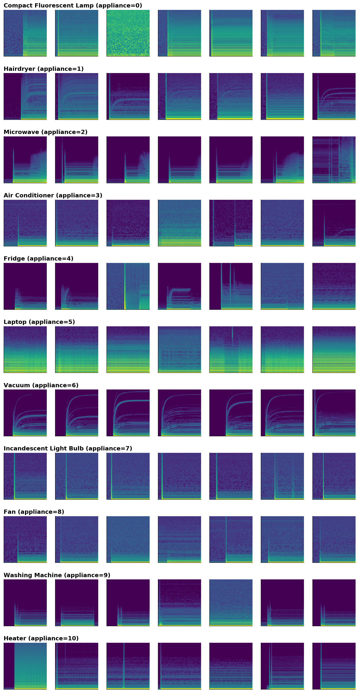
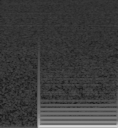
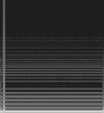
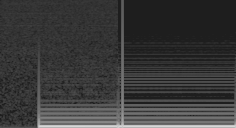
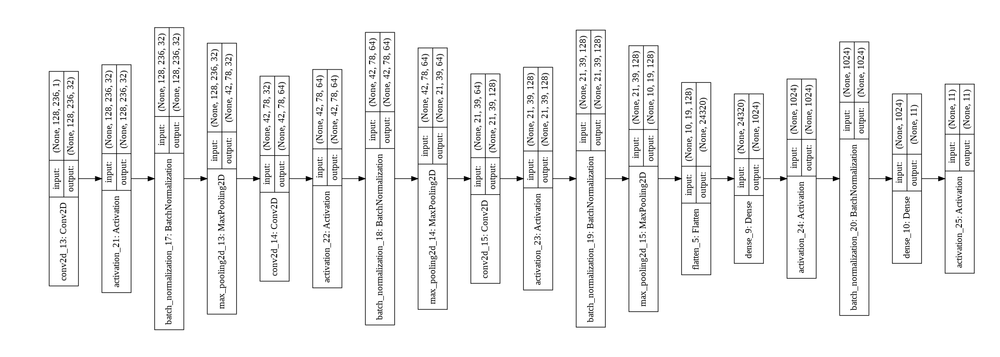

# Microsoft-AI-Capstone-Solution (Microsoft - DAT264x - October 2018)

## Identifying Appliances from Energy Use Patterns

### Quick Summary

In October 2018 Microsoft launched the **Microsoft Professional Capstone : Artificial Intelligence** course in collaboration with DrivenData. The course itself is basically the final exam in the Microsoft Professional Program for AI track.

The rules were very simple: have 85% prediction accuracy on a prediction challenge and you will pass the exam; have less and you will fail (along with failing to achieve the program certificate in the current run). To add more incentives for a good result Microsoft decided to organize a competition, so there is always more at stake for those candidates who want to leave a mark.  

In the following, we will present the core model and techniques that ensured not only an exam pass (100 out of 100 points) but also the second place in the competition (see [Competition Leaderboard](https://datasciencecapstone.org/competitions/10/appliances-energy-use/leaderboard/) ).

### The challenge

According to a 2017 report, the U.S. Energy Information Administration projects a 28% increase in world energy consumption by 2040. And the energy sector is a major contributor to climate change. For example, energy production and use accounts for more than 84% of U.S. greenhouse gas emissions.

Increasing the efficiency of energy consumption has benefits for consumers, providers, and the environment. With an increasing number of IoT devices coming online in the energy sector, there is more and more data that can be used to monitor and track energy consumption. Ultimately, this type of data can be used to provide consumers and businesses with recommendations on ways to save energy, lower costs, and help the planet.

The goal is to predict types of appliances from spectrograms of current and voltage measurements. A spectrogram is a visual representation of the various frequencies of sound as they vary with time. These spectrograms were generated from current and voltage measurements sampled at 30 kHz from 11 different appliance types present in more than 60 households in Pittsburgh, Pennsylvania, USA. Data collection took place during the summer of 2013, and winter of 2014. Each appliance type is represented by dozens of different instances of varying make/models.

### The data

The data available for the challenge was as follows:

- The training data consisting of 988 instances, each instance having a current and a spectrogram image;
- The testing data consisting of 659 instances, each instance having a current and a spectrogram image.

A sample of such spectrograms could be seen bellow:

The appliance classes considered for both prediction and classification are bellow:

* 0: Compact Fluorescent Lamp
* 1: Hairdryer
* 2: Microwave
* 3: Air Conditioner
* 4: Fridge
* 5: Laptop
* 6: Vacuum
* 7: Incandescent Light Bulb
* 8: Fan
* 9: Washing Machine
* 10: Heater

### Predicting the appliance classes

In the following we will describe the process performed for predicting the appliance classes from their associated spectrograms.

#### Data preparation

For every instance (be it training or testing) we have a **current** spectrogram and a **voltage** spectrogram. Both spectrograms are to be considered in order to ensure a proper prediction of the appliance classes.
We decided to horizontally stack the image data for each appliance starting with the **current** spectrogram and concatenating it with the **voltage** spectrogram along the width axis (x-axis).

An example of such processing can be seen as follows:

|Current Spectrogram|Voltage Spectrogram|Result|
|---|---|---|
||||

For the final submission, no further image processing has been done (we tried de-noising, enhancement, shape detection - yet this did not lead to improvements in prediction rate).

The image data from the training and test dataset were written in a convenient binary format for easier processing.

#### Neural network model

Our neural network model was conceived inspired by the VGG-16 architecture, albeit with a good degree of simplification and with the usage of normalization (we used Keras BatchNormalization layers and that lead to a significant improvement of results).

The architecture of the neural network can be seen bellow:

 

The architecture of the neural network can be summed up as follows:

- The model is a sequential model, no parallel layers were considered in this architecture;

- The model is based on a convolutional network having four convolution blocks in the following format:

**[Conv2d] => [Relu Activation] => [Batch Normalization] => [MaxPooling]**

- The final block consists of the following: 

**[Flatten] => [Dense] => [Dense] => [Softmax Activation]**

Despite its relative simplicity, this model has been the basis for obtaining the best results. It is resource friendly and fast to train (we used Google Colab with a GPU enabled runtime, training took around 5 seconds per epoch).

#### Error analysis

In order to obtain the best score with this model, we have performed the following steps: 

1. Running this model on the training data set provided an initial accuracy of 97.12% (0.9712 score on the datasciencecapstone.org);

2. Modifying the parameters of the model (convolution size and dense layer size) we have observed that a portion of 80% of test data remain constant for predicted classes. We have assumed that the model has a low variance and actually the predictions which are constant (regardless the modification of model parameters) are correct predictions. We have trained the model again on the test dataset plus the test data which was consistently predicted (considering predicted classes as ground truth) and we obtained an accuracy rate of 97.88% (0.9788 score on the datasciencecapstone.org);

3. By repeating the previous step with different changes in model parameters and analyzing the data that was correctly predicted and data that was changed - we have obtained a final accuracy rate of 98.18 % (0.9818 score on the datasciencecapstone.org).

This final score ensured the second position on the leaderboard and 100 out of 100 points in the grading of AI capstone exam on EDX.

### Code instructions

The code for resolving this challenge consists of two main files:

* **prepare_data.py** - which is used to prepare data for neural network prediction. It extracts from the data delivery zip file all the training and testing data along with the submission labels and submission format;
* **classify_data.py** - which is used to read the extracted data and predict test classes. It will create a **submission_results.csv** results file in the data directory.

Run **prepare_data.py** first and then **classify_data.py** afterwards to obtain the submission results.

Please note that this is the baseline model; the model (having the same basic architecture) which has been fine-tuned based on the repeated error analysis process will be kept private for now.
